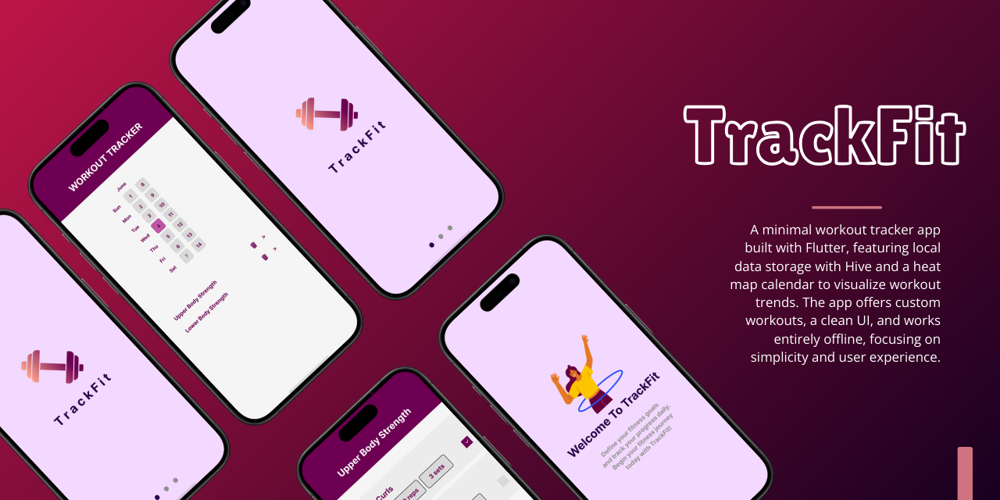

# Minimal Workout Tracker App 🏋️‍♂️📱

This app is designed with simplicity and functionality in mind, ensuring that users can effortlessly track their workouts. Leveraging Hive for local data storage and integrating a heat map calendar, this app offers a seamless experience that emphasizes both speed and privacy.

Key Features
Hive Backend: Efficient local data storage with Hive, ensuring quick access and seamless performance without the need for an internet connection. Your data is securely stored locally, providing both speed and privacy.

Heat Map Calendar: Visualize your workout frequency and progress with an intuitive heat map calendar. This feature makes it easy to spot trends, stay motivated, and track your consistency over time.

Custom Workouts and Exercises: Personalize your fitness routines by adding custom workouts and exercises. Tailor your fitness journey to your specific goals and preferences.

Clean UI: Enjoy a fresh, modern look with a light color scheme designed to enhance the user experience. The minimalistic design ensures that the app is both functional and visually appealing.

Overview
Whether you're tracking your daily workouts or looking to build consistent habits, this app is your perfect companion to help you stay on track and achieve your fitness goals. Ready to elevate your fitness journey? Download the app and get started today!

